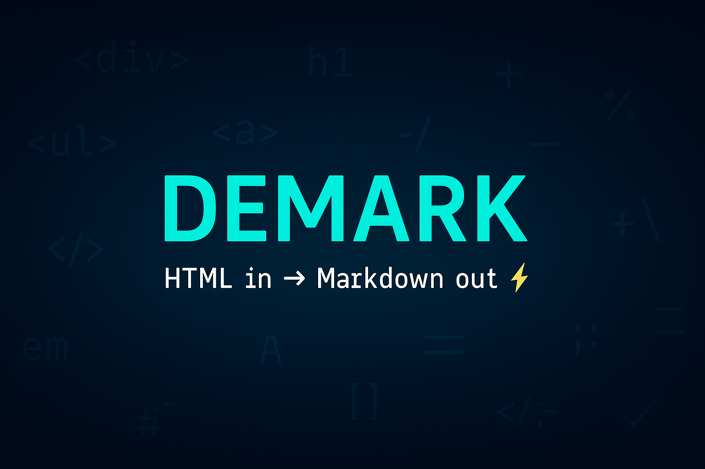

# Demark: Mark My Words, HTML to Markdown!



**The Swift package that turns down HTML and turns up Markdown – it's a markup markdown!**

[](https://swift.org)
[](https://developer.apple.com/swift/)
[](LICENSE)

## Features

- 🌍 **Universal Apple Platform Support**: Works seamlessly on iOS, macOS, watchOS, tvOS, and visionOS
- 🎯 **WKWebView Integration**: Real browser DOM environment for accurate HTML parsing
- ⚡ **Turndown.js Powered**: Industry-standard HTML to Markdown conversion engine
- 🔒 **Swift 6 Ready**: Full concurrency support with strict checking enabled
- ⚙️ **Highly Configurable**: Extensive formatting options for customized output
- 📝 **CommonMark Compliant**: Standard Markdown output that works everywhere
- 🚀 **Async/Await**: Modern Swift concurrency for smooth performance
- 🎨 **Zero Dependencies**: Only requires WebKit framework

## Quick Start

```swift
import Demark

@MainActor
func convertHTML() async throws {
    let demark = Demark()
    let html = "<h1>Hello World</h1><p>This is <strong>bold</strong> text.</p>"
    let markdown = try await demark.convertToMarkdown(html)
    print(markdown)
    // Output: # Hello World
    //
    // This is **bold** text.
}
```

## Conversion Engines

Demark provides two HTML to Markdown conversion engines, each with different trade-offs:

### 1. Turndown.js (Default) - Full-Featured DOM-Based Conversion

**How it works**: Uses WKWebView to load Turndown.js in a real browser environment with full DOM parsing.

**Advantages**:
- 🎯 **Most accurate conversion**: Real browser DOM parsing handles complex/malformed HTML
- 🛡️ **Battle-tested**: Turndown.js is the industry standard used by millions
- ⚙️ **Full configuration options**: Supports all formatting styles (ATX/Setext headings, code block styles)
- 🌐 **Handles any HTML**: Processes JavaScript-rendered content, inline styles, complex nesting

**Disadvantages**:
- 🐌 **Slower performance**: ~100ms first conversion (WebView setup), ~10-50ms subsequent
- 💾 **Higher memory usage**: WKWebView has significant overhead
- 🧵 **Main thread only**: WebView requires main thread execution

**When to use**:
- Converting complex HTML from websites or CMSs
- Need maximum compatibility and accuracy
- Processing user-generated or untrusted HTML
- Require full configuration options

### 2. html-to-md - Lightweight JavaScript Engine

**How it works**: Uses JavaScriptCore to run html-to-md directly without WebView overhead.

**Advantages**:
- ⚡ **Much faster**: ~5-10ms per conversion (10x faster than Turndown)
- 💾 **Lower memory footprint**: No WebView overhead
- 🧵 **Background thread capable**: Can run on any thread via serial queue
- 🔋 **Better for batch processing**: Ideal for converting many documents

**Disadvantages**:
- 📉 **Less accurate**: String-based parsing may struggle with complex HTML
- ⚙️ **Limited configuration**: Fewer formatting options available
- 🚫 **No DOM environment**: Cannot handle JavaScript-rendered content
- 🐛 **Less mature**: Newer library, may have edge cases

**When to use**:
- High-performance requirements or batch conversions
- Simple, well-formed HTML content
- Memory-constrained environments (watchOS, widgets)
- Background processing needs

### Usage Example

```swift
// Using Turndown (default)
let options = DemarkOptions(
    engine: .turndown,  // Full-featured, most accurate
    headingStyle: .atx,
    bulletListMarker: "-"
)

// Using html-to-md for performance
let fastOptions = DemarkOptions(
    engine: .htmlToMd  // Fast, lightweight
    // Note: Some options like headingStyle are ignored with html-to-md
)

let markdown = try await demark.convertToMarkdown(html, options: fastOptions)
```

### Performance Comparison

| Engine | First Conversion | Subsequent | Memory | Thread Safety |
|--------|-----------------|------------|---------|---------------|
| Turndown.js | ~100ms | ~10-50ms | ~20MB | Main thread only |
| html-to-md | ~5-10ms | ~5-10ms | ~5MB | Any thread |

### Recommendation

- **Start with Turndown.js** (default) for maximum compatibility
- **Switch to html-to-md** only if you need the performance boost and your HTML is simple
- **Test both** with your actual content to ensure quality meets your needs

### 🎯 Try the Example App

Want to see Demark in action? Check out the comprehensive example app:

```bash
# Quick start - run the helper script
./run-example.sh

# Or run manually
cd Example
swift run DemarkExample
```

The example app provides a dual-pane interface where you can input HTML on the left and see both the generated Markdown source and rendered output on the right. Perfect for testing and understanding Demark's capabilities!

## Requirements

- **Swift 6.0+**
- **iOS 17.0+** / **macOS 14.0+** / **watchOS 10.0+** / **tvOS 17.0+** / **visionOS 1.0+**
- **WebKit framework**

## Installation

### Swift Package Manager

Add Demark to your project using Swift Package Manager. In Xcode, go to **File > Add Package Dependencies** and enter:

```
https://github.com/steipete/Demark.git
```

Or add it to your `Package.swift`:

```swift
dependencies: [
    .package(url: "https://github.com/steipete/Demark.git", from: "1.0.0")
]
```

Then add it to your target:

```swift
.target(
    name: "YourTarget",
    dependencies: ["Demark"]
)
```

## Usage

### Basic Conversion

```swift
import Demark

@MainActor
class ContentConverter {
    private let demark = Demark()
    
    func convertContent(_ html: String) async throws -> String {
        return try await demark.convertToMarkdown(html)
    }
}
```

### Custom Configuration

Demark supports extensive customization through `DemarkOptions`:

```swift
let options = DemarkOptions(
    headingStyle: .setext,      // Use underline-style headings
    bulletListMarker: "*",      // Use asterisks for bullets  
    codeBlockStyle: .fenced     // Use fenced code blocks
)

let markdown = try await demark.convertToMarkdown(html, options: options)
```

### Platform-Specific Usage

#### iOS App Example

```swift
import SwiftUI
import Demark

struct ContentView: View {
    @State private var markdown = ""
    private let demark = Demark()
    
    var body: some View {
        VStack {
            Text(markdown)
                .padding()
            
            Button("Convert HTML") {
                Task { @MainActor in
                    let html = "<h2>iOS Example</h2><p>Converting on iOS!</p>"
                    markdown = try await demark.convertToMarkdown(html)
                }
            }
        }
    }
}
```

#### macOS App Example

```swift
import AppKit
import Demark

class DocumentController: NSDocument {
    private let demark = Demark()
    
    @MainActor
    func convertHTMLDocument(_ html: String) async throws -> String {
        let options = DemarkOptions(
            headingStyle: .atx,
            bulletListMarker: "-",
            codeBlockStyle: .fenced
        )
        return try await demark.convertToMarkdown(html, options: options)
    }
}
```

## Configuration Options

### DemarkOptions

Configure how HTML elements are converted to Markdown:

| Option | Type | Default | Description |
|--------|------|---------|-------------|
| `headingStyle` | `DemarkHeadingStyle` | `.atx` | Heading format (ATX `#` or Setext underline) |
| `bulletListMarker` | `String` | `"-"` | Character for unordered lists (`"-"`, `"*"`, or `"+"`) |
| `codeBlockStyle` | `DemarkCodeBlockStyle` | `.fenced` | Code block format (fenced ``` or indented) |

### Heading Styles

```swift
// ATX style (default): # Heading 1, ## Heading 2
let atxOptions = DemarkOptions(headingStyle: .atx)

// Setext style: Heading 1\n=========, Heading 2\n---------  
let setextOptions = DemarkOptions(headingStyle: .setext)
```

### List Markers

```swift
let dashOptions = DemarkOptions(bulletListMarker: "-")    // - Item
let starOptions = DemarkOptions(bulletListMarker: "*")    // * Item  
let plusOptions = DemarkOptions(bulletListMarker: "+")    // + Item
```

### Code Block Styles

```swift
// Fenced (default): ```\ncode\n```
let fencedOptions = DemarkOptions(codeBlockStyle: .fenced)

// Indented:     code
let indentedOptions = DemarkOptions(codeBlockStyle: .indented)
```

## Supported HTML Elements

Demark handles all standard HTML elements that Turndown.js supports:

- **Headings**: `<h1>` through `<h6>`
- **Text formatting**: `<strong>`, `<em>`, `<code>`, `<del>`, `<ins>`, `<sup>`, `<sub>`
- **Lists**: `<ul>`, `<ol>`, `<li>` with proper nesting
- **Links and images**: `<a>`, `` with attributes
- **Code blocks**: `<pre>`, `<code>` with language detection  
- **Tables**: `<table>`, `<tr>`, `<td>`, `<th>` (GitHub Flavored Markdown)
- **Block elements**: `<div>`, `<p>`, `<blockquote>`, `<hr>`
- **Custom elements**: `<del>`, `<ins>`, `<sup>`, `<sub>` are preserved

## Error Handling

Demark provides comprehensive error handling with detailed error messages:

```swift
do {
    let markdown = try await demark.convertToMarkdown(html)
    // Success!
} catch DemarkError.turndownLibraryNotFound {
    // JavaScript library not found in bundle
} catch DemarkError.conversionFailed {  
    // HTML conversion failed
} catch DemarkError.invalidInput(let details) {
    // Invalid HTML input: details
} catch DemarkError.webViewInitializationFailed {
    // WKWebView couldn't be created
} catch {
    // Other errors
    print("Conversion error: \(error.localizedDescription)")
}
```

## Thread Safety & Performance

### Main Actor Requirement

⚠️ **Important**: Demark requires main thread execution due to WKWebView constraints:

```swift
// ✅ Correct - on main thread
@MainActor  
func convertHTML() async throws -> String {
    let demark = Demark()
    return try await demark.convertToMarkdown(html)
}

// ✅ Also correct - dispatch to main
func convertHTML() async throws -> String {
    return try await MainActor.run {
        let demark = Demark()
        return try await demark.convertToMarkdown(html)
    }
}
```

### Performance Characteristics

- **First Conversion**: ~100ms (includes one-time WKWebView setup)
- **Subsequent Conversions**: ~10-50ms (reuses WebView instance)
- **Memory Efficient**: Single WebView per Demark instance
- **Platform Optimized**: Different configurations for each platform

## Platform Support Details

### macOS (14.0+)
- Full functionality with desktop optimizations
- Enhanced JavaScript execution environment
- Optimized for large document processing

### iOS (17.0+) & visionOS (1.0+)
- Full functionality with mobile/spatial optimizations  
- Respects system memory constraints
- Optimized for touch/gesture interfaces

### watchOS (10.0+) & tvOS (17.0+)
- Core functionality with minimal WebView footprint
- Optimized for limited resources
- Essential conversion features available

## Examples

### Converting Blog Content

```swift
let blogHTML = """
<article>
    <h1>My Blog Post</h1>
    <p>Welcome to my <strong>awesome</strong> blog!</p>
    <ul>
        <li>First point</li>
        <li>Second point with <a href="https://example.com">link</a></li>
    </ul>
    <blockquote>
        <p>This is a quote from someone famous.</p>
    </blockquote>
</article>
"""

let markdown = try await demark.convertToMarkdown(blogHTML)
```

### Converting Documentation

```swift
let docHTML = """
<div class="documentation">
    <h2>API Reference</h2>
    <p>The <code>convert</code> function takes the following parameters:</p>
    <pre><code class="swift">
func convert(_ html: String) async throws -> String
    </code></pre>
</div>
"""

let options = DemarkOptions(
    headingStyle: .atx,
    codeBlockStyle: .fenced
)

let markdown = try await demark.convertToMarkdown(docHTML, options: options)
```

## Contributing

Contributions are welcome! Please feel free to submit issues, feature requests, and pull requests.

### Development Setup

1. Clone the repository
2. Open `Package.swift` in Xcode
3. Run tests with `⌘+U`
4. Make your changes
5. Ensure all tests pass
6. Submit a pull request

### Running Tests

```bash
swift test
```

### Code Quality

This project uses SwiftLint and SwiftFormat to maintain code quality:

```bash
# Install tools (if not already installed)
brew install swiftlint swiftformat

# Run linting and formatting checks
./scripts/lint.sh

# Auto-fix formatting issues
./scripts/swiftformat.sh

# Auto-fix some lint issues
./scripts/swiftlint.sh --fix
```

## License

Demark is available under the MIT license. See the [LICENSE](LICENSE) file for more info.

## Credits

- **Turndown.js**: The powerful HTML to Markdown conversion engine by [Dom Christie](https://github.com/mixmark-io/turndown)
- **Swift Community**: For the amazing Swift language and ecosystem
- **WebKit Team**: For providing the robust WKWebView framework

## Alternatives

If Demark doesn't fit your needs, consider these alternatives:

- **Server-side conversion**: Use Turndown.js directly in Node.js
- **Pure Swift**: Implement a custom HTML parser (more complex)
- **Web-based**: Use a web service for conversion (requires network)

---

**Made with ❤️ for the Swift community**